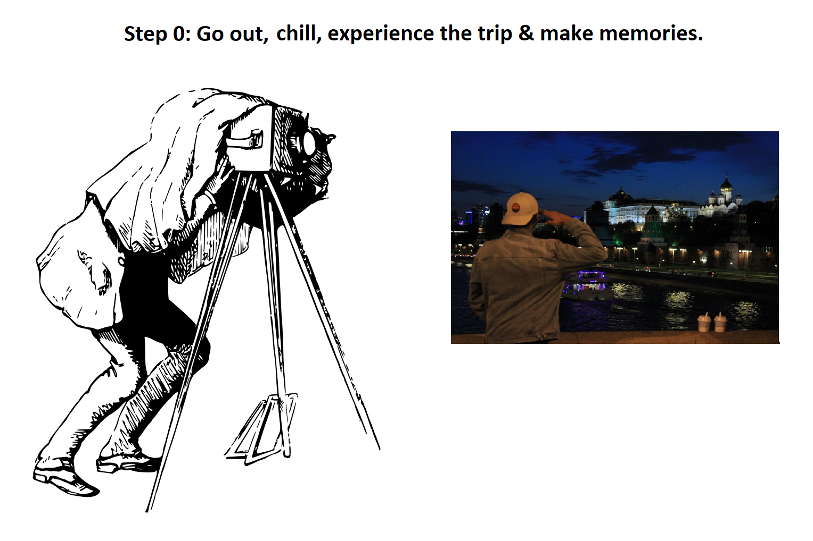
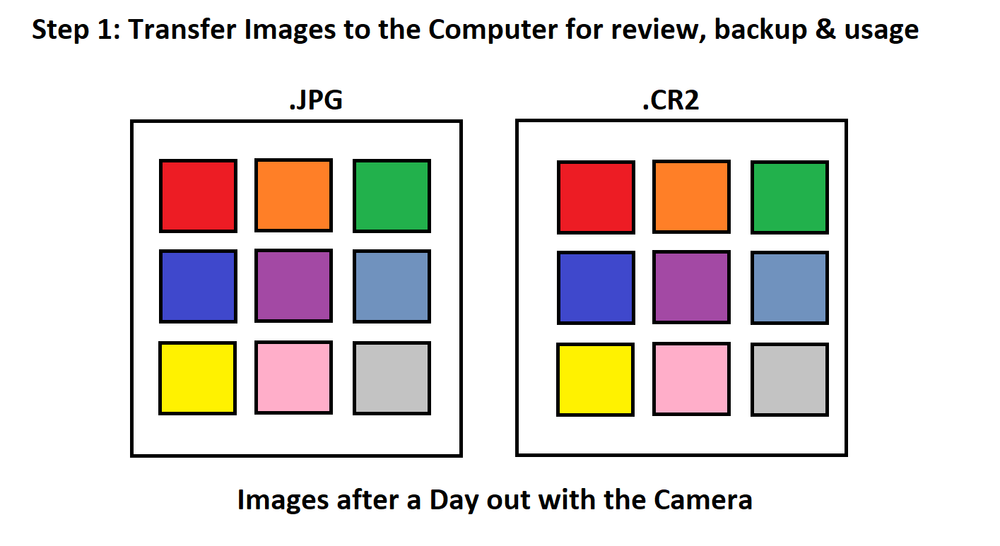
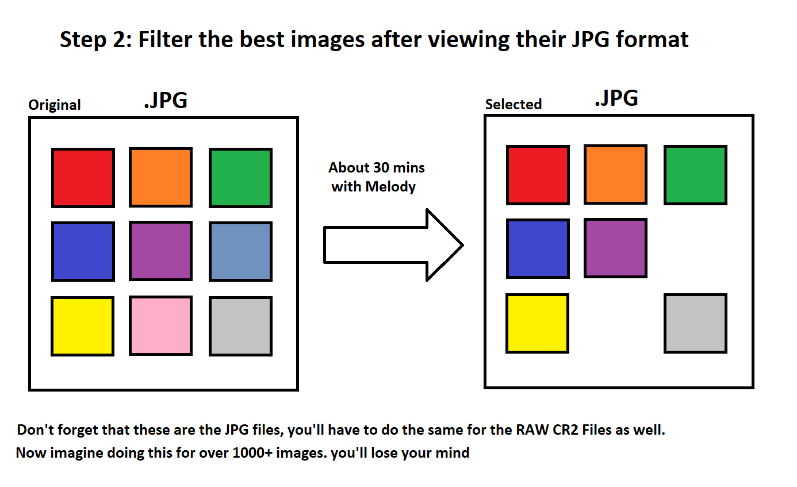
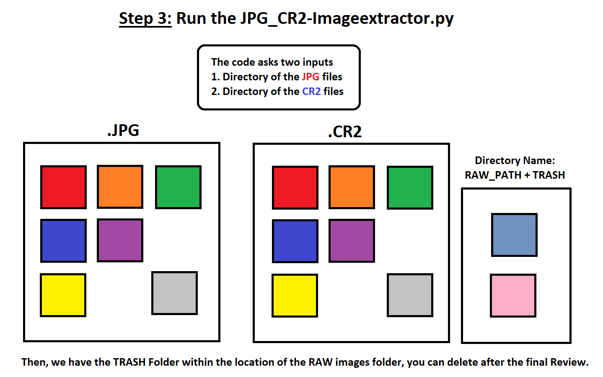
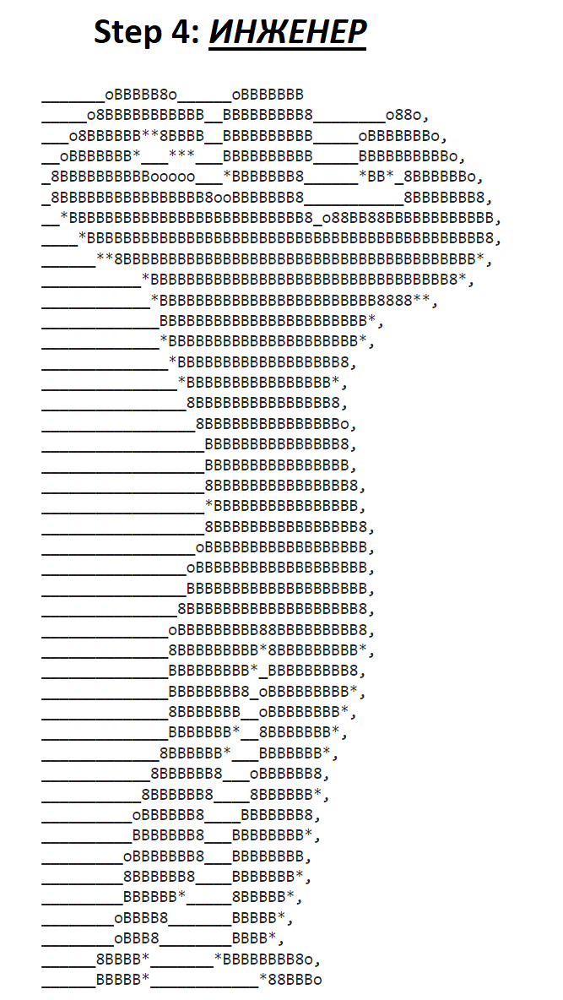

# JPG-CR2-Extractor

After a Day out with the Camera, I end up with a ton of pictures. After selecting the best pictures I delete the bad pictures. This is a time consuming process. However, the RAW pictures have to be filtered again, this process takes a long time. 

Hence, this code does the work by obtaining the location of the selected JPG files & filters the CR2 Files for final review & deletion. 

It can also work for other applications of mass file operations, just have to make sure to change the extensions of the files from .JPG, .CR2 to the relevant ones in usage. 

# The Guide is as follows:

